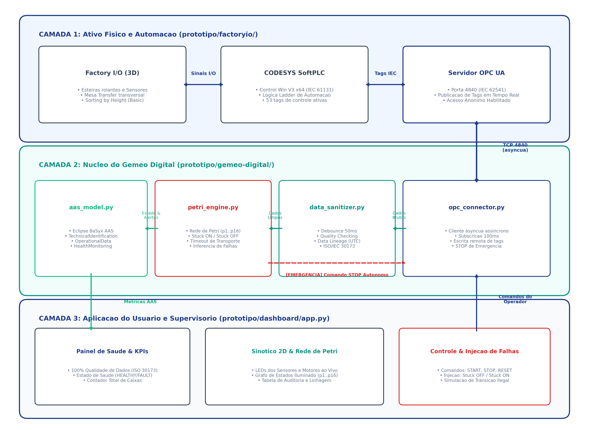
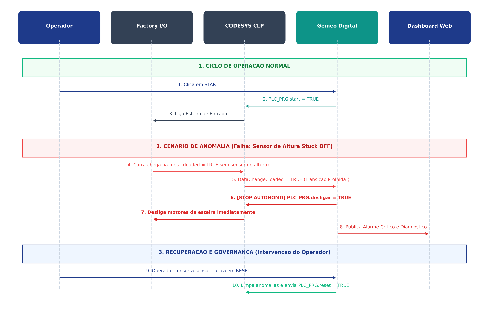

# 🏛️ Arquitetura do Protótipo de Gêmeo Digital Industrial

Este documento apresenta o detalhamento técnico e conceitual da arquitetura do **Gêmeo Digital (Digital Twin)** para a linha de separação de caixas (*Sorting by Height*). 

A implementação foi estruturada com base nas normas internacionais:
* **ISO 23247:2021** (*Automation systems and integration — Digital twin framework for manufacturing*).
* **ISO/IEC 30173:2025** (*Digital twin — Concepts, terminology and governance framework*).
* **IEC 62541** (*OPC Unified Architecture*).
* **Plataforma Indústria 4.0 / Eclipse BaSyx** (*Asset Administration Shell - AAS*).

---

## 1. Visão Geral da Arquitetura em 3 Camadas

A arquitetura segue o modelo de 3 camadas da norma **ISO 23247**, complementada pela camada de conteinerização para portabilidade:



---

## 2. Detalhamento dos Módulos e Funcionamento

### 2.1 Camada 1: Ativo Físico & Automação (`prototipo/factoryio/`)
* **Propósito:** Representar o mundo físico real.
* **Componentes:**
  * **Factory I/O (`Sorting by Height - Basic`):** Simula a física 3D das esteiras rolantes, sensores ópticos de presença (`palletSensor`), sensor óptico de altura (`highSensor`), mesa de transferência com correntes transversais (`transferLeft`, `transferRight`) e esteiras de saída.
  * **CODESYS Control Win V3 x64 (`SortingByHeight_Basic.project`):** SoftPLC que executa a lógica de controle programada em linguagem Ladder.
  * **Servidor OPC UA:** Expõe as 53 variáveis de processo (`PLC_PRG.*`) na porta 4840 para leitura e escrita externa com acesso anônimo autenticado.

---

### 2.2 Camada 2: Núcleo do Gêmeo Digital (`prototipo/gemeo-digital/`)

#### A. Sanitização de Dados e Governança (`data_sanitizer.py`):
Em conformidade com a norma **ISO/IEC 30173**, dados industriais brutos não devem alimentar modelos de tomada de decisão sem higienização prévia (*evitar o problema "Garbage In, Garbage Out"*):
1. **Debouncing de 50 ms:** Elimina repiques mecânicos e trepidações ópticas dos sensores de presença que poderiam disparar falsas contagens de caixas.
2. **Validação de Qualidade:** Verifica se o status de comunicação da tag OPC UA é estritamente `GOOD`.
3. **Linhagem de Dados (*Data Lineage*):** Transforma o dado bruto em um registro auditável contendo carimbo de data/hora (UTC ISO 8601), origem da leitura, tipo de dado estrito e flag de validade.

#### B. Motor de Diagnóstico por Rede de Petri (`petri_engine.py`):
Enquanto o CLP usa a Rede de Petri apenas para mover os motores, o **Gêmeo Digital utiliza a Rede de Petri como um modelo formal de fiscalização e auditoria**:
* **Lugares ($p_1 \dots p_{16}$):** Representam os estados possíveis da esteira (ex: $p_1$ Repouso, $p_2$ Caixa em trânsito de entrada, $p_5$ Caixa alta identificada, $p_7$ Desvio para a esquerda ativo).
* **Transições ($t_1 \dots t_{17}$):** Disparadas pelos eventos sanitizados dos sensores da planta.
* **Regras de Detecção de Anomalias:**
  * 🔴 **Sensor de Altura Quebrado (*Stuck OFF*):** Se uma caixa atinge o sensor da mesa (`loaded = True`) sem que o sensor de altura tenha registrado sinal prévio durante o estado $p_2$ $\rightarrow$ **Dispara Anomalia Crítica de Transição Proibida**.
  * 🔴 **Sensor de Presença Travado (*Stuck ON*):** Se o `palletSensor` permanecer em nível lógico alto por mais de 2.5 segundos enquanto a esteira está ligada $\rightarrow$ **Dispara Alerta de Risco de Engavetamento**.
  * 🔴 **Timeout de Transporte (Caixa Engavetada / Motor Travado):** Se a esteira de entrada permanecer ligada por mais de 4.0 segundos sem que a caixa atinja o próximo sensor $\rightarrow$ **Dispara Parada de Segurança por Bloqueio de Linha**.

#### C. Casca Administrativa do Ativo - AAS (`aas_model.py`):
Implementa a representação do ativo conforme o padrão **Eclipse BaSyx** da Indústria 4.0, construída sobre o **SDK oficial `basyx-python-sdk`** (`basyx.aas.model`) em vez de estruturas ad-hoc — os elementos (`Property`, `Submodel`, `SubmodelElementList`, `SubmodelElementCollection`) são objetos nativos do metamodelo AAS v3, e a exportação usa o serializador oficial (`basyx.aas.adapter.json.object_store_to_json`), produzindo um arquivo no formato *Environment* padrão, consumível por submodel repositories reais do ecossistema BaSyx:
* **Submodelo `TechnicalIdentification`:** Metadados do equipamento, número de série, fabricante, normas de governança aplicadas (ISO 30173 / ISO 23247 / ISO 16739).
* **Submodelo `OperationalData`:** Variáveis de telemetria em tempo real (estados das esteiras, sensores e contador de caixas).
* **Submodelo `HealthAndDiagnostics`:** Score de integridade (`HEALTHY` ou `CRITICAL_FAULT`), lista de lugares ativos da Rede de Petri, lista estruturada de anomalias ativas e carimbo de tempo do último incidente.
* **Submodelo `SpatialContext` (vínculo BIM/IFC — ISO 16739):** Ancora o ativo a elementos geométricos **reais** do modelo IFC via `IfcGlobalId`/`IfcElementType`, mais o caminho do arquivo (`IfcFilePath`), a posição espacial do elemento primário (`PositionX_m/Y_m/Z_m`, `BuildingStorey`) e uma lista `IfcElementMap` com o GlobalId de cada um dos 6 elementos monitorados (esteiras, sensores, mesa de transferência). Liga a camada semântica do AAS (o que o ativo *é* e como está operando) à camada espacial do BIM (onde o ativo *está* na planta). Os valores são lidos em tempo de inicialização de `models/ifc_element_map.json` — se o modelo IFC não existir, os campos ficam vazios em vez de apontar para um GUID inventado.
* **Exportação:** Permite exportar toda a casca administrativa (Shell + 4 submodelos) no formato oficial JSON do metamodelo AAS v3 para integração com ecossistemas BaSyx.

#### D. Camada Espacial / BIM (`gemeo-digital/models/`, `ifc_viewer.py`):
Implementa a camada geométrica do Gêmeo Digital, ausente nas versões anteriores do protótipo:
* **`models/build_ifc_model.py`:** Script de autoria que gera `sorting_by_height.ifc` (schema IFC4, ISO 16739-1:2018) via `ifcopenshell` — hierarquia espacial completa (`IfcProject > IfcSite > IfcBuilding > IfcBuildingStorey`) com 6 elementos (esteira de entrada, sensor de presença, sensor de altura, mesa de transferência, esteiras de saída), cada um com geometria (`IfcExtrudedAreaSolid`) e posição 3D. Grava também `ifc_element_map.json`, o mapa tag OPC UA → GlobalId consumido pelo AAS e pelo visualizador.
* **Nota de modelagem:** o IFC4 é um schema orientado a AEC e não possui classes dedicadas para esteiras/sensores industriais (isso só existe em IFC4.3, ainda pouco suportado por ferramentas). Os elementos usam `IfcTransportElement`/`IfcSensor` com `PredefinedType=USERDEFINED` + `ObjectType` descritivo — o mecanismo padrão do schema para categorias fora do enum. É uma fricção real entre os vocabulários de manufatura (ISO 23247) e de AEC (ISO 16739), documentada aqui para o registro do trabalho.
* **Coordenadas:** aproximadas/nominais, estimadas a partir do layout típico da cena *Sorting by Height - Basic* do Factory I/O — não medidas via laser scan da cena real. Ajustáveis no dicionário `ELEMENTS` do script.
* **`ifc_viewer.py`:** Abre `sorting_by_height.ifc` via `ifcopenshell.geom` (cache em memória, geometria é estática), triangula cada elemento e monta uma cena `Mesh3d` do Plotly. A cor de cada elemento é recalculada a cada atualização do dashboard a partir do estado ao vivo (tag sanitizada) e das anomalias ativas da Rede de Petri (casamento por palavra-chave no campo `component` do `AnomalyReport`).

#### E. Conector OPC UA Bidirecional (`opc_connector.py`):
* Utiliza a biblioteca `asyncua` para criar uma conexão assíncrona de alta performance.
* Implementa o padrão *Observer / Subscription* (`SAMPLING_RATE_MS = 100ms`).
* **Ação Autônoma de Segurança:** Ao receber uma notificação de anomalia crítica do `petri_engine`, o conector envia imediatamente o comando `desligar = True` e `stop = True` para o CLP, parando a linha física antes que ocorra quebra de produto ou engavetamento.

---

### 2.3 Camada 3: Aplicação Supervisória do Usuário (`prototipo/dashboard/`)
* **Interface Web em Streamlit (`app.py`):**
  * **Header e KPIs de Governança:** Status de saúde do ativo em tempo real, percentual de qualidade dos dados sanitizados (100%), total de eventos processados e estado ativo da Rede de Petri.
  * **Sinótico 2D da Linha:** Visualização gráfica com LEDs dinâmicos (verde/cinza) indicando o estado de cada sensor óptico e esteira.
  * **Grafo Interativo da Rede de Petri:** Diagrama de estados que ilumina o nó ativo ($p_1, p_2 \dots$) conforme a caixa se move.
  * **Tabela de Auditoria (ISO/IEC 30173):** Histórico completo de eventos higienizados, latência e origem dos dados.
  * **Painel de Controle e Injeção de Falhas:** Botões para o operador iniciar a linha, aplicar Parada de Emergência, resetar falhas e injetar anomalias sintéticas para fins de auditoria e demonstração.
  * **Visualização 3D (BIM/IFC):** Cena 3D interativa (Plotly `Mesh3d`) construída a partir da geometria real de `models/sorting_by_height.ifc`, com cada elemento colorido pelo estado ao vivo do Gêmeo Digital (cinza/verde/vermelho) — a mesma semântica do sinótico 2D, aplicada a um modelo espacial real em vez de ícones fixos.

---

## 3. Fluxo de Vida: Operação Normal vs. Detecção de Falha



---

## 4. Estrutura de Arquivos do Projeto

```text
prototipo/
├── Dockerfile                      # Definição do container Docker Python
├── docker-compose.yml              # Orquestração do ambiente conteinerizado
├── README.md                       # Guia rápido de instalação e comandos
├── requirements.txt                # Dependências do ecossistema Python
│
├── docs/                           # Documentações e Especificações
│   ├── ARQUITETURA.md              # Este documento de especificação arquitetural
│   ├── ARQUITETURA.pdf             # Versão PDF formatada para entrega
│   ├── especificacao-gemeo-digital.pdf
│   └── img/                        # Diagramas em alta resolução
│       ├── arquitetura_3_camadas.png
│       └── fluxo_sequencia.png
│
├── factoryio/                      # Camada 1: Ativo Físico
│   ├── SortingByHeight_Basic.project  # Projeto CODESYS
│   ├── SortingByHeight_Basic.xml      # Símbolos exportados
│   ├── index.html                     # Manual de tags da cena
│   └── monitoramentoOPCUA.py          # Script original do colega
│
├── gemeo-digital/                  # Camada 2: Núcleo do Gêmeo Digital
│   ├── config.py                      # Configurações de conexão e tempos
│   ├── data_sanitizer.py              # Sanitização, debouncing e linhagem ISO 30173
│   ├── petri_engine.py                # Máquina de estados da Rede de Petri e regras de falha
│   ├── aas_model.py                   # Casca administrativa (AAS) via basyx-python-sdk
│   ├── opc_connector.py               # Conector OPC UA assíncrono e controle autônomo
│   ├── ifc_viewer.py                  # Geometria IFC (ifcopenshell) -> cena 3D Plotly
│   └── models/                        # Camada Espacial / BIM (ISO 16739)
│       ├── build_ifc_model.py            # Autoria do modelo IFC4 (fonte de verdade)
│       ├── sorting_by_height.ifc         # Modelo IFC4 gerado
│       └── ifc_element_map.json          # Mapa tag OPC UA -> elemento IFC
│
└── dashboard/                      # Camada 3: Aplicação do Usuário
    └── app.py                         # Interface Web Streamlit (inclui aba 3D/BIM)
```

---

## 5. Conclusão

Esta arquitetura cumpre integralmente os requisitos de um **Gêmeo Digital de Nível 4 (Inteligente e Autônomo)** conforme a literatura técnica:
1. **Representação Digital Padronizada (AAS / BaSyx):** O ativo físico possui uma identidade digital estruturada e interoperável.
2. **Sincronismo Bidirecional de Alta Velocidade (OPC UA):** Leitura de eventos em tempo real e escrita de comandos de emergência.
3. **Governança e Confiabilidade dos Dados (ISO/IEC 30173):** Sanitização prévia com eliminação de ruídos e auditoria de qualidade.
4. **Capacidade de Ação Autônoma e Diagnóstico (Rede de Petri):** O sistema não é apenas um visualizador passivo, mas atua como um sistema supervisório capaz de interromper a planta diante de desvios operacionais.
5. **Contextualização Espacial via BIM (ISO 16739):** O ativo não existe apenas como dado semântico — está ancorado a uma geometria real (IFC), permitindo visualização 3D e abrindo caminho para integração com o modelo BIM completo de uma planta/instalação.
